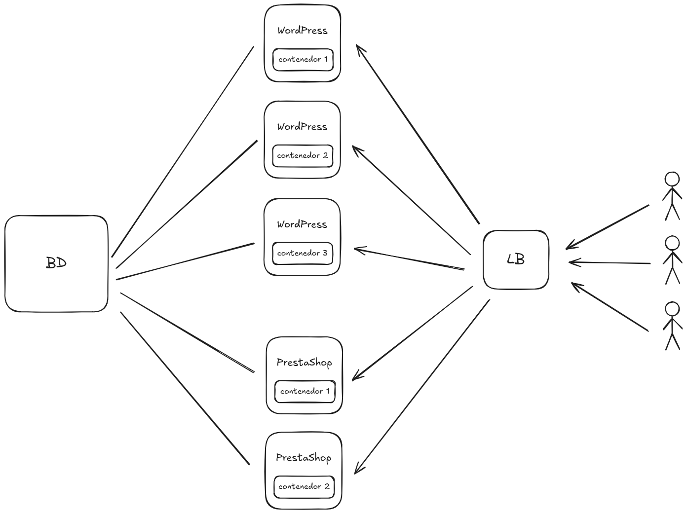

Joan Pomares Herrero

 

# Práctica 1 - Reto WordPress en formato Microservicios

### 1. Arquitectura del sistema

</img>

### 2. Plan de escalado.

Para el escalado horizontal, usaria Kubernete, ya que me permite ajustar la cantidad de contenedores creados apartir de imagenes de docker, con los servicios de WordPress y prestashop, dependiendo del uso de recursos y la cantidad de peticiones.

De esta manera podemos escalar la cantidad de contenedores dependiendo de las necesidades del sistema. 

Para la base de datos, el almacenamiento y las copias de seguridad seran de escalado vertical, aumentanto sus recursos cuando sea necesario.

El balanceador de carga será un componente nativo de la nube, que expondrá el Ingress Controller de Kubernetes. Este dirigirá el trafico a el servicio correcto

### 3. Copias de seguridad.

Para las copias de seguridad se haran copias cada cierto tiempo de la informacion en la base de datos, en el almacenamiento de objetos y algunas configuraciones de kubernetes, y se guardaran en la nube utilizada.

### 4. Versiones 

- WordPress 6.8.3
- PrestaShop 8.1
- PHP 8.2
- Docker 26.0
- Kubernetes 1.30.1
- MariaDB 10.11

